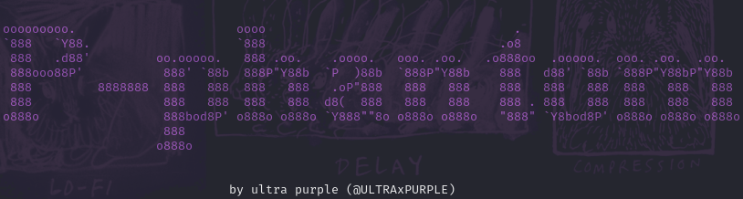

# Purple Phantom

Purple Phantom is a directory brute-forcing tool designed for penetration testers and ethical hackers to discover hidden directories and resources on web servers. What sets Purple Phantom apart from other tools is its ability to detect duplicate pages, which often occur in cases where a website misleads the user by:

*-Redirecting to the homepage for non-existent directories, returning a 200 HTTP status code, regardless of the directory entered.*

*-Redirecting to a custom error page (e.g., "Sorry, page not found") that also returns a 200 HTTP status code, despite not actually serving unique content.*

This tool goes beyond the traditional methods of directory discovery, which rely solely on HTTP status codes like 200 (OK), 301 (Redirect), or 404 (Not Found). Instead, Purple Phantom analyzes the content size of each page, identifying duplicate pages based on slight differences in length. This way, you can focus on finding the actual unique directories that may contain valuable information or be vulnerable to exploitation.

<div align="center">



</div>

## Features

- Scans websites for directories using a customizable wordlist.
- Displays the HTTP status and size of each discovered page.
- Filters out duplicate directories and pages.

## Installation

1. Clone the repository:
   ```bash
   git clone https://github.com/ultraxpurple/Purple-Phantom.git
   ```

2. Navigate to the project directory:
   ```bash
   cd Purple-Phantom
   ```

3. Install required libraries:
   ```bash
   pip install -r requirements.txt
   ```

## Usage

Run the tool:
```bash
python p-phantom.py -u <base_url> -w <wordlist_path>
```

- `<base_url>`: The target website URL (e.g., https://example.com).
- `<wordlist_path>`: Path to your wordlist file.

View the results in the console.

## Contributing

Feel free to fork the repository and submit a pull request!

## Contact

For any inquiries or suggestions, please reach out to me on GitHub.

Enjoy discovering directories!
